# Mô hình dữ liệu và ERD thiết kế mục tiêu

**31/10/2026 · Mô hình logic, chưa phải schema/DDL/migration đang chạy.** Giữ các đối tượng lõi; bổ sung work management/workforce/automation/knowledge. Field/type/index vật lý cần refinement theo PostgreSQL + SQLAlchemy + Alembic, không Django ORM.

## Đối tượng lõi

| Đối tượng | Dữ liệu/ràng buộc |
|---|---|
| User / Department | Email chuẩn hóa unique, role/active/department/version; Argon2id; không xóa lịch sử |
| Session | User, opaque token hash, expiry/revoked, CSRF; khóa user thu hồi phiên |
| Team / TeamMembership / TicketCategory | Active/intake, membership hiện tại; lịch sử tham chiếu không bị xóa |
| Ticket | Requester, loại/category, impact/urgency/priority, team/assignee/asset, status/version; mục tiêu/deadline và thông tin cấu trúc workflow khi có |
| TicketComment / TicketEvent / Attachment | Visibility, actor, nội dung/event cũ/mới/lý do, object key riêng tư; quyền theo nội dung cha |
| SLAPolicy / TicketSLA / SLAInterval / SLAViolation | Snapshot P1–P4, clocks/elapsed/first response, adjustment revision, breach/dedup |
| Asset / AssetAssignment | Mã/serial/model/bảo hành/status; user/department snapshot/actor/returnedAt; tối đa một assignment hiệu lực |
| Notification / AuditLog | Recipient/event/readAt; actor/time/before/after/reason đã lọc secret; scope hiện tại |

## Đối tượng công việc, nhân lực, automation và AI

| Đối tượng | Dữ liệu/ràng buộc |
|---|---|
| WorkPlan / PlanVersion | Ticket, mục tiêu, version, Draft/Effective/Superseded/Cancelled, sources; một version Effective/ticket; các version cũ bất biến |
| Task | PlanVersion, title, team/assignee, status/version, estimated/remaining minutes, earliestStart/deadline, required skills, result, assignment lock/actor/reason |
| TaskDependency | Task và predecessor cùng PlanVersion; không self-edge/cycle; dependency bắt buộc Done trước Ready/start |
| TaskSkillRequirement | Task, skill, mức tối thiểu nếu có và nguồn yêu cầu; dùng taxonomy được xác nhận, không tự suy ra chứng chỉ |
| Skill / UserSkill | Nhãn chuẩn, mức nếu có, người xác nhận/thời điểm/version; skill chưa xác nhận không mặc định hợp lệ |
| WorkCalendar / AvailabilityException | User, timezone, working intervals/weekdays, absence intervals/version; không phải hệ thống chấm công |
| CapacityPeriod / WorkAllocation | User, khoảng kỳ và capacity; task/version + phân bổ remaining theo kỳ/slot; tổng không vượt capacity sau trừ absence |
| WorkflowTemplate / TemplateVersion | Workflow, Published/Draft/Retired, steps/DAG/skills/effort đã duyệt, sources/version; không tự coi estimate model là đã xác thực |
| AutomationPolicy / PolicyVersion | Enabled, workflow/team/priority/action/limits, grantor và thời hạn/version; default deny |
| ServiceIdentity / PolicyGrant | AI_COORDINATOR và scope được giao, grantor; không đăng nhập bằng Admin chung |
| DomainEvent / OutboxDelivery | Event ID/type/aggregate/version/correlation/actor/payload tối thiểu; delivery attempt/lease/nextAttempt/result |
| AutomationRun / AutomationAction | Event/purpose, policy/grantor/source/model/prompt versions, snapshot, proposal/tool intent, target/idempotency, result/error/usage |
| ApprovalRequest / ApprovalDecision | Before/after/tác động/lý do/snapshot version; owner/decider/decision, trạng thái quyết định tách execution |
| AIConversation / AIMessage / AISourceReference / AIDraft | Owner/visibility/context; source/version/ACL; nháp không là domain entity |
| ConfirmedCommand | User, preview digest/version, xác nhận/TTL, idempotency key/result reference; cùng key khác nội dung conflict |
| KnowledgeArticle / KnowledgeVersion / KnowledgeACL | Nháp/Published/Retired, immutable version, owner/publisher/read scope; thu hồi hiệu lực ngay |
| KnowledgeChunk / KnowledgeEmbedding | Version/chunk, vector/model/dimension/index status; truy xuất vẫn kiểm ACL hiện tại |
| AIUsage / AIBudgetLedger | Run/request, input/output/cached/reasoning usage khi có, giá/version/ngày, reserved/actual/unknown cost, quota/calls |

[DBML và ánh xạ schema](../database/README.md) cung cấp biểu diễn trường chọn lọc có thể đọc bằng công cụ DBML; không là DDL/migration. Map source_versions/snapshot_versions là JSON nhiều aggregate/version, không một số nguyên.

## ERD logic

Các góc nhìn tách theo miền để đọc entity, khóa và cardinality. Các trường là phần chọn lọc theo mục đích từng hình, không phải toàn bộ schema. Tên field/type là đề xuất logic, cần review trước SQLAlchemy/Alembic; nullable/index/FK vật lý và exact naming chưa đóng băng. Entity lặp ở hai hình là cùng entity, không tạo bảng mới. Cardinality của nguồn tổng được giữ nguyên.

| Góc nhìn | Phạm vi |
|---|---|
| FIG-ERD02 | [Danh tính và tổ chức](../diagrams/erd-identity.svg) |
| FIG-ERD03 | [Ticket, hội thoại và tệp](../diagrams/erd-ticket-sla.svg) |
| FIG-ERD04 | [Tài sản và lịch sử cấp phát](../diagrams/erd-assets.svg) |
| FIG-ERD05 | [Kế hoạch, task và dependency](../diagrams/erd-work-plans.svg) |
| FIG-ERD06 | [Kỹ năng, lịch và allocation](../diagrams/erd-workforce.svg) |
| FIG-ERD07 | [Policy, phiên bản và grant](../diagrams/erd-policy.svg) |
| FIG-ERD08 | [Sự kiện, thực thi và audit](../diagrams/erd-execution.svg) |
| FIG-ERD09 | [Kiến thức, ACL và chỉ mục](../diagrams/erd-knowledge.svg) |
| FIG-ERD10 | [Hội thoại và nguồn tham chiếu](../diagrams/erd-assistant.svg) |
| FIG-ERD11 | [Xác nhận ticket và chi phí AI](../diagrams/erd-confirmation-usage.svg) |
| FIG-ERD12 | [Snapshot và đồng hồ SLA](../diagrams/erd-sla-clocks.svg) |

TaskDependency có hai đầu task/predecessor cùng PlanVersion. Các field actor/source là tham chiếu logic theo loại, không cam kết FK đa hình. Entity bên ngoài miền được lặp lại để giữ ngữ cảnh. Đọc quy tắc actor, nguồn usage và unique có điều kiện tại bảng invariant phía dưới.

### FIG-ERD02 — Danh tính và tổ chức



Nguồn Mermaid và cardinality

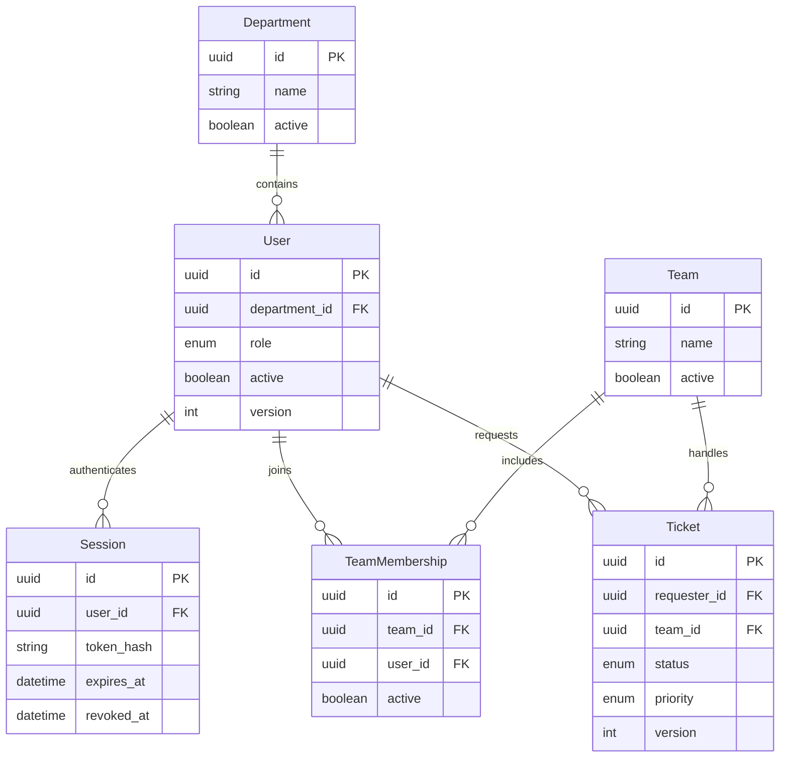
```mermaid
erDiagram
    direction TB
    Department {
        uuid id PK
        string name
        boolean active
    }
    Session {
        uuid id PK
        uuid user_id FK
        string token_hash
        datetime expires_at
        datetime revoked_at
    }
    Team {
        uuid id PK
        string name
        boolean active
    }
    TeamMembership {
        uuid id PK
        uuid team_id FK
        uuid user_id FK
        boolean active
    }
    Ticket {
        uuid id PK
        uuid requester_id FK
        uuid team_id FK
        enum status
        enum priority
        int version
    }
    User {
        uuid id PK
        uuid department_id FK
        enum role
        boolean active
        int version
    }
    Department ||--o{ User : contains
    User ||--o{ Session : authenticates
    User ||--o{ TeamMembership : joins
    Team ||--o{ TeamMembership : includes
    User ||--o{ Ticket : requests
    Team ||--o{ Ticket : handles
```

### FIG-ERD03 — Ticket, hội thoại và tệp



Nguồn Mermaid và cardinality

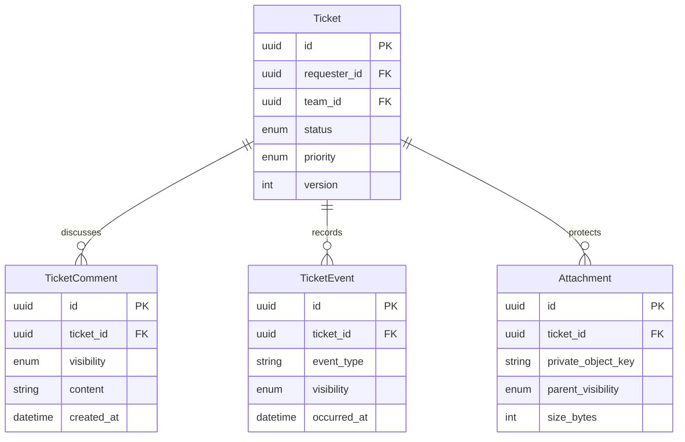
```mermaid
erDiagram
    direction TB
    Attachment {
        uuid id PK
        uuid ticket_id FK
        string private_object_key
        enum parent_visibility
        int size_bytes
    }
    Ticket {
        uuid id PK
        uuid requester_id FK
        uuid team_id FK
        enum status
        enum priority
        int version
    }
    TicketComment {
        uuid id PK
        uuid ticket_id FK
        enum visibility
        string content
        datetime created_at
    }
    TicketEvent {
        uuid id PK
        uuid ticket_id FK
        string event_type
        enum visibility
        datetime occurred_at
    }
    Ticket ||--o{ TicketComment : discusses
    Ticket ||--o{ TicketEvent : records
    Ticket ||--o{ Attachment : protects
```

### FIG-ERD04 — Tài sản và lịch sử cấp phát



Nguồn Mermaid và cardinality

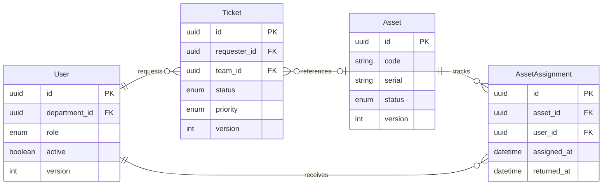
```mermaid
erDiagram
    direction LR
    Asset {
        uuid id PK
        string code
        string serial
        enum status
        int version
    }
    AssetAssignment {
        uuid id PK
        uuid asset_id FK
        uuid user_id FK
        datetime assigned_at
        datetime returned_at
    }
    Ticket {
        uuid id PK
        uuid requester_id FK
        uuid team_id FK
        enum status
        enum priority
        int version
    }
    User {
        uuid id PK
        uuid department_id FK
        enum role
        boolean active
        int version
    }
    User ||--o{ Ticket : requests
    Asset ||--o{ AssetAssignment : tracks
    User ||--o{ AssetAssignment : receives
    Ticket }o--o| Asset : references
```

### FIG-ERD05 — Kế hoạch, task và dependency



Nguồn Mermaid và cardinality

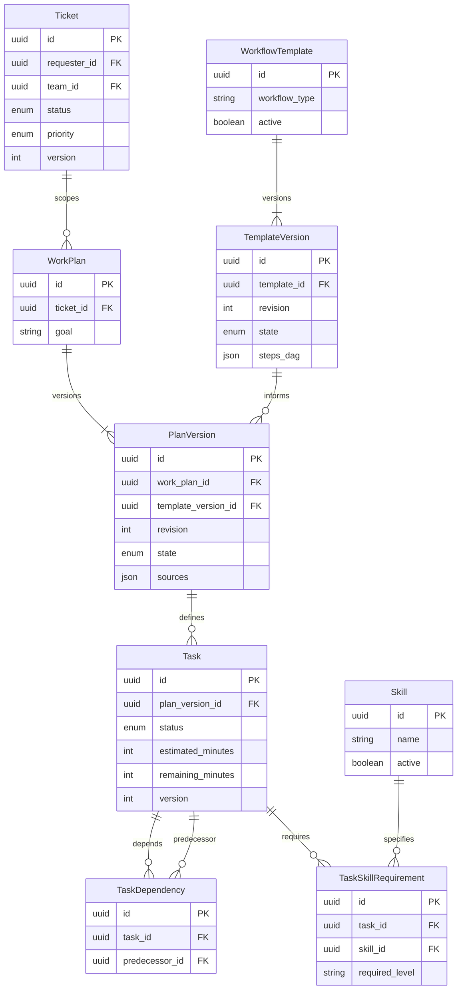
```mermaid
erDiagram
    direction TB
    PlanVersion {
        uuid id PK
        uuid work_plan_id FK
        uuid template_version_id FK
        int revision
        enum state
        json sources
    }
    Skill {
        uuid id PK
        string name
        boolean active
    }
    Task {
        uuid id PK
        uuid plan_version_id FK
        enum status
        int estimated_minutes
        int remaining_minutes
        int version
    }
    TaskDependency {
        uuid id PK
        uuid task_id FK
        uuid predecessor_id FK
    }
    TaskSkillRequirement {
        uuid id PK
        uuid task_id FK
        uuid skill_id FK
        string required_level
    }
    TemplateVersion {
        uuid id PK
        uuid template_id FK
        int revision
        enum state
        json steps_dag
    }
    Ticket {
        uuid id PK
        uuid requester_id FK
        uuid team_id FK
        enum status
        enum priority
        int version
    }
    WorkPlan {
        uuid id PK
        uuid ticket_id FK
        string goal
    }
    WorkflowTemplate {
        uuid id PK
        string workflow_type
        boolean active
    }
    Ticket ||--o{ WorkPlan : scopes
    WorkPlan ||--|{ PlanVersion : versions
    PlanVersion ||--o{ Task : defines
    Task ||--o{ TaskDependency : depends
    Task ||--o{ TaskDependency : predecessor
    Task ||--o{ TaskSkillRequirement : requires
    Skill ||--o{ TaskSkillRequirement : specifies
    WorkflowTemplate ||--|{ TemplateVersion : versions
    TemplateVersion ||--o{ PlanVersion : informs
```

### FIG-ERD06 — Kỹ năng, lịch và allocation



Nguồn Mermaid và cardinality

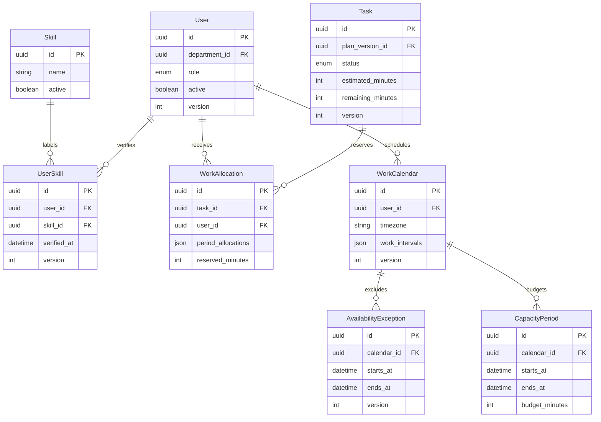
```mermaid
erDiagram
    direction TB
    AvailabilityException {
        uuid id PK
        uuid calendar_id FK
        datetime starts_at
        datetime ends_at
        int version
    }
    CapacityPeriod {
        uuid id PK
        uuid calendar_id FK
        datetime starts_at
        datetime ends_at
        int budget_minutes
    }
    Skill {
        uuid id PK
        string name
        boolean active
    }
    Task {
        uuid id PK
        uuid plan_version_id FK
        enum status
        int estimated_minutes
        int remaining_minutes
        int version
    }
    User {
        uuid id PK
        uuid department_id FK
        enum role
        boolean active
        int version
    }
    UserSkill {
        uuid id PK
        uuid user_id FK
        uuid skill_id FK
        datetime verified_at
        int version
    }
    WorkAllocation {
        uuid id PK
        uuid task_id FK
        uuid user_id FK
        json period_allocations
        int reserved_minutes
    }
    WorkCalendar {
        uuid id PK
        uuid user_id FK
        string timezone
        json work_intervals
        int version
    }
    Task ||--o{ WorkAllocation : reserves
    User ||--o{ WorkAllocation : receives
    User ||--o{ UserSkill : verifies
    Skill ||--o{ UserSkill : labels
    User ||--o{ WorkCalendar : schedules
    WorkCalendar ||--o{ AvailabilityException : excludes
    WorkCalendar ||--o{ CapacityPeriod : budgets
```

### FIG-ERD07 — Policy, phiên bản và grant



Nguồn Mermaid và cardinality

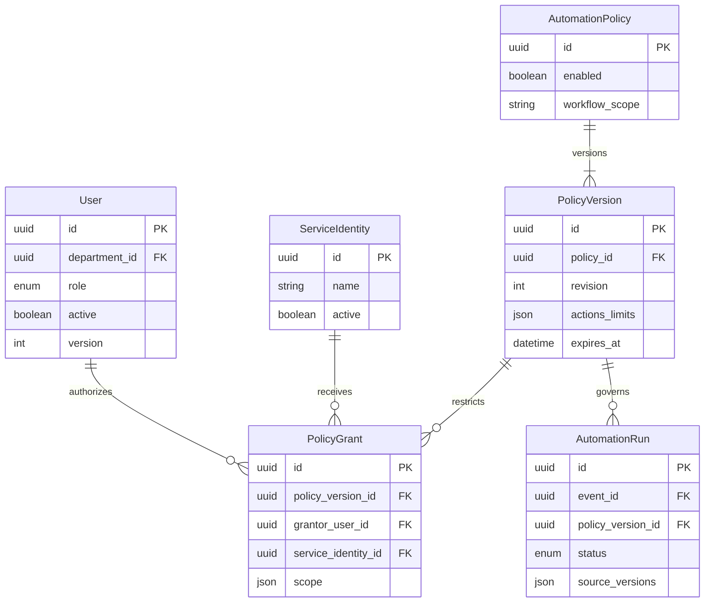
```mermaid
erDiagram
    direction TB
    AutomationPolicy {
        uuid id PK
        boolean enabled
        string workflow_scope
    }
    AutomationRun {
        uuid id PK
        uuid event_id FK
        uuid policy_version_id FK
        enum status
        json source_versions
    }
    PolicyGrant {
        uuid id PK
        uuid policy_version_id FK
        uuid grantor_user_id FK
        uuid service_identity_id FK
        json scope
    }
    PolicyVersion {
        uuid id PK
        uuid policy_id FK
        int revision
        json actions_limits
        datetime expires_at
    }
    ServiceIdentity {
        uuid id PK
        string name
        boolean active
    }
    User {
        uuid id PK
        uuid department_id FK
        enum role
        boolean active
        int version
    }
    AutomationPolicy ||--|{ PolicyVersion : versions
    User ||--o{ PolicyGrant : authorizes
    ServiceIdentity ||--o{ PolicyGrant : receives
    PolicyVersion ||--o{ PolicyGrant : restricts
    PolicyVersion ||--o{ AutomationRun : governs
```

### FIG-ERD08 — Sự kiện, thực thi và audit



Nguồn Mermaid và cardinality

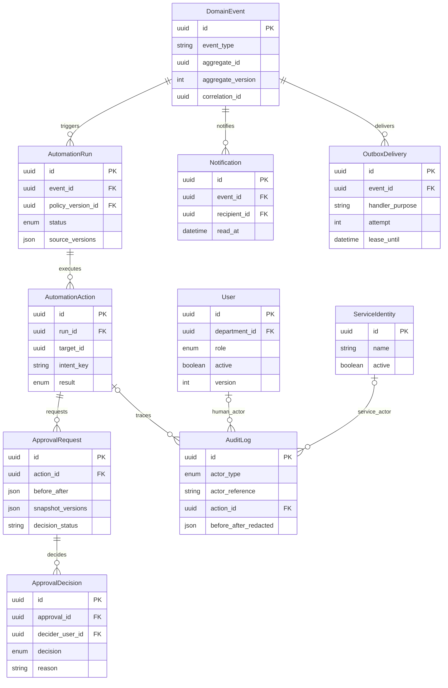
```mermaid
erDiagram
    direction TB
    ApprovalDecision {
        uuid id PK
        uuid approval_id FK
        uuid decider_user_id FK
        enum decision
        string reason
    }
    ApprovalRequest {
        uuid id PK
        uuid action_id FK
        json before_after
        json snapshot_versions
        string decision_status
    }
    AuditLog {
        uuid id PK
        enum actor_type
        string actor_reference
        uuid action_id FK
        json before_after_redacted
    }
    AutomationAction {
        uuid id PK
        uuid run_id FK
        uuid target_id
        string intent_key
        enum result
    }
    AutomationRun {
        uuid id PK
        uuid event_id FK
        uuid policy_version_id FK
        enum status
        json source_versions
    }
    DomainEvent {
        uuid id PK
        string event_type
        uuid aggregate_id
        int aggregate_version
        uuid correlation_id
    }
    Notification {
        uuid id PK
        uuid event_id FK
        uuid recipient_id FK
        datetime read_at
    }
    OutboxDelivery {
        uuid id PK
        uuid event_id FK
        string handler_purpose
        int attempt
        datetime lease_until
    }
    ServiceIdentity {
        uuid id PK
        string name
        boolean active
    }
    User {
        uuid id PK
        uuid department_id FK
        enum role
        boolean active
        int version
    }
    DomainEvent ||--o{ OutboxDelivery : delivers
    DomainEvent ||--o{ AutomationRun : triggers
    AutomationRun ||--o{ AutomationAction : executes
    AutomationAction ||--o{ ApprovalRequest : requests
    ApprovalRequest ||--o{ ApprovalDecision : decides
    DomainEvent ||--o{ Notification : notifies
    AutomationAction o|--o{ AuditLog : traces
    User o|--o{ AuditLog : human_actor
    ServiceIdentity o|--o{ AuditLog : service_actor
```

### FIG-ERD09 — Kiến thức, ACL và chỉ mục



Nguồn Mermaid và cardinality

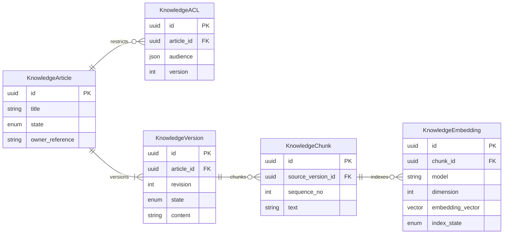
```mermaid
erDiagram
    direction LR
    KnowledgeACL {
        uuid id PK
        uuid article_id FK
        json audience
        int version
    }
    KnowledgeArticle {
        uuid id PK
        string title
        enum state
        string owner_reference
    }
    KnowledgeChunk {
        uuid id PK
        uuid source_version_id FK
        int sequence_no
        string text
    }
    KnowledgeEmbedding {
        uuid id PK
        uuid chunk_id FK
        string model
        int dimension
        vector embedding_vector
        enum index_state
    }
    KnowledgeVersion {
        uuid id PK
        uuid article_id FK
        int revision
        enum state
        string content
    }
    KnowledgeArticle ||--|{ KnowledgeVersion : versions
    KnowledgeArticle ||--o{ KnowledgeACL : restricts
    KnowledgeVersion ||--o{ KnowledgeChunk : chunks
    KnowledgeChunk ||--o{ KnowledgeEmbedding : indexes
```

### FIG-ERD10 — Hội thoại và nguồn tham chiếu



Nguồn Mermaid và cardinality

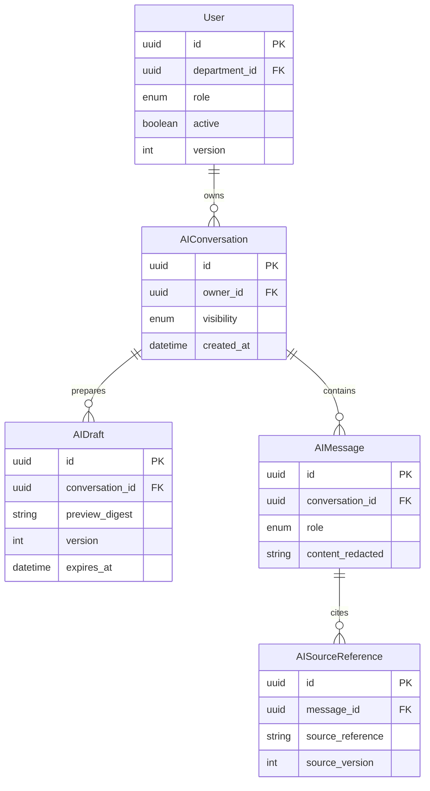
```mermaid
erDiagram
    direction TB
    AIConversation {
        uuid id PK
        uuid owner_id FK
        enum visibility
        datetime created_at
    }
    AIDraft {
        uuid id PK
        uuid conversation_id FK
        string preview_digest
        int version
        datetime expires_at
    }
    AIMessage {
        uuid id PK
        uuid conversation_id FK
        enum role
        string content_redacted
    }
    AISourceReference {
        uuid id PK
        uuid message_id FK
        string source_reference
        int source_version
    }
    User {
        uuid id PK
        uuid department_id FK
        enum role
        boolean active
        int version
    }
    User ||--o{ AIConversation : owns
    AIConversation ||--o{ AIMessage : contains
    AIMessage ||--o{ AISourceReference : cites
    AIConversation ||--o{ AIDraft : prepares
```

### FIG-ERD11 — Xác nhận ticket và chi phí AI



Nguồn Mermaid và cardinality

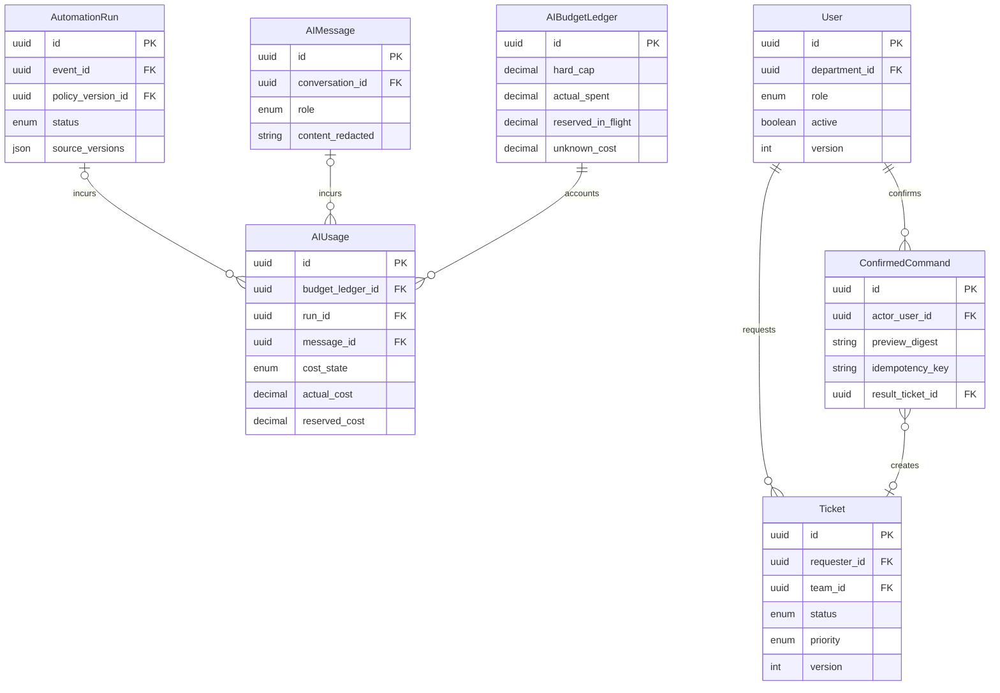
```mermaid
erDiagram
    direction TB
    AIBudgetLedger {
        uuid id PK
        decimal hard_cap
        decimal actual_spent
        decimal reserved_in_flight
        decimal unknown_cost
    }
    AIMessage {
        uuid id PK
        uuid conversation_id FK
        enum role
        string content_redacted
    }
    AIUsage {
        uuid id PK
        uuid budget_ledger_id FK
        uuid run_id FK
        uuid message_id FK
        enum cost_state
        decimal actual_cost
        decimal reserved_cost
    }
    AutomationRun {
        uuid id PK
        uuid event_id FK
        uuid policy_version_id FK
        enum status
        json source_versions
    }
    ConfirmedCommand {
        uuid id PK
        uuid actor_user_id FK
        string preview_digest
        string idempotency_key
        uuid result_ticket_id FK
    }
    Ticket {
        uuid id PK
        uuid requester_id FK
        uuid team_id FK
        enum status
        enum priority
        int version
    }
    User {
        uuid id PK
        uuid department_id FK
        enum role
        boolean active
        int version
    }
    User ||--o{ Ticket : requests
    User ||--o{ ConfirmedCommand : confirms
    ConfirmedCommand }o--o| Ticket : creates
    AutomationRun o|--o{ AIUsage : incurs
    AIMessage o|--o{ AIUsage : incurs
    AIBudgetLedger ||--o{ AIUsage : accounts
```

### FIG-ERD12 — Snapshot và đồng hồ SLA



Nguồn Mermaid và cardinality

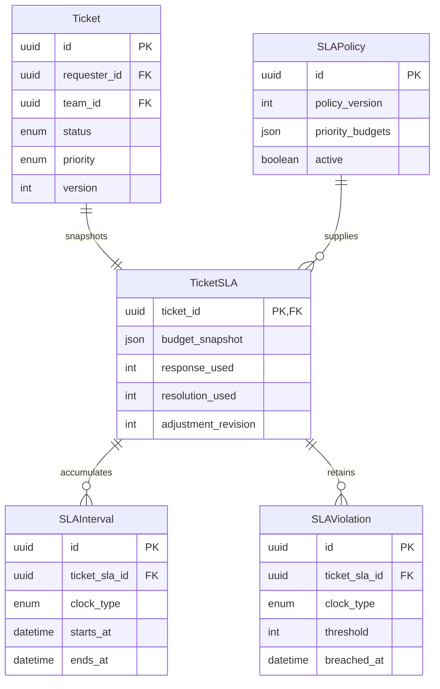
```mermaid
erDiagram
    direction TB
    SLAInterval {
        uuid id PK
        uuid ticket_sla_id FK
        enum clock_type
        datetime starts_at
        datetime ends_at
    }
    SLAPolicy {
        uuid id PK
        int policy_version
        json priority_budgets
        boolean active
    }
    SLAViolation {
        uuid id PK
        uuid ticket_sla_id FK
        enum clock_type
        int threshold
        datetime breached_at
    }
    Ticket {
        uuid id PK
        uuid requester_id FK
        uuid team_id FK
        enum status
        enum priority
        int version
    }
    TicketSLA {
        uuid ticket_id PK, FK
        json budget_snapshot
        int response_used
        int resolution_used
        int adjustment_revision
    }
    Ticket ||--|| TicketSLA : snapshots
    TicketSLA ||--o{ SLAInterval : accumulates
    TicketSLA ||--o{ SLAViolation : retains
    SLAPolicy ||--o{ TicketSLA : supplies
```

### FIG-ERD01 — Danh sách quan hệ tổng

Toàn bộ quan hệ làm nguồn đối chiếu các góc nhìn

```mermaid
erDiagram
    Department ||--o{ User : contains
    User ||--o{ Session : authenticates
    User ||--o{ TeamMembership : joins
    Team ||--o{ TeamMembership : includes
    User ||--o{ Ticket : requests
    Team ||--o{ Ticket : handles
    Ticket ||--|| TicketSLA : snapshots
    Ticket ||--o{ TicketComment : discusses
    Ticket ||--o{ TicketEvent : records
    Ticket ||--o{ Attachment : protects
    TicketSLA ||--o{ SLAInterval : accumulates
    TicketSLA ||--o{ SLAViolation : retains
    SLAPolicy ||--o{ TicketSLA : supplies
    Asset ||--o{ AssetAssignment : tracks
    User ||--o{ AssetAssignment : receives
    Ticket }o--o| Asset : references
    Ticket ||--o{ WorkPlan : scopes
    WorkPlan ||--|{ PlanVersion : versions
    PlanVersion ||--o{ Task : defines
    Task ||--o{ TaskDependency : depends
    Task ||--o{ TaskDependency : predecessor
    Task ||--o{ TaskSkillRequirement : requires
    Skill ||--o{ TaskSkillRequirement : specifies
    Task ||--o{ WorkAllocation : reserves
    User ||--o{ WorkAllocation : receives
    User ||--o{ UserSkill : verifies
    Skill ||--o{ UserSkill : labels
    User ||--o{ WorkCalendar : schedules
    WorkCalendar ||--o{ AvailabilityException : excludes
    WorkCalendar ||--o{ CapacityPeriod : budgets
    WorkflowTemplate ||--|{ TemplateVersion : versions
    TemplateVersion ||--o{ PlanVersion : informs
    AutomationPolicy ||--|{ PolicyVersion : versions
    User ||--o{ PolicyGrant : authorizes
    ServiceIdentity ||--o{ PolicyGrant : receives
    PolicyVersion ||--o{ PolicyGrant : restricts
    DomainEvent ||--o{ OutboxDelivery : delivers
    DomainEvent ||--o{ AutomationRun : triggers
    PolicyVersion ||--o{ AutomationRun : governs
    AutomationRun ||--o{ AutomationAction : executes
    AutomationAction ||--o{ ApprovalRequest : requests
    ApprovalRequest ||--o{ ApprovalDecision : decides
    KnowledgeArticle ||--|{ KnowledgeVersion : versions
    KnowledgeArticle ||--o{ KnowledgeACL : restricts
    KnowledgeVersion ||--o{ KnowledgeChunk : chunks
    KnowledgeChunk ||--o{ KnowledgeEmbedding : indexes
    User ||--o{ AIConversation : owns
    AIConversation ||--o{ AIMessage : contains
    AIMessage ||--o{ AISourceReference : cites
    AIConversation ||--o{ AIDraft : prepares
    User ||--o{ ConfirmedCommand : confirms
    ConfirmedCommand }o--o| Ticket : creates
    AutomationRun o|--o{ AIUsage : incurs
    AIMessage o|--o{ AIUsage : incurs
    AIBudgetLedger ||--o{ AIUsage : accounts
    DomainEvent ||--o{ Notification : notifies
    AutomationAction o|--o{ AuditLog : traces
    User o|--o{ AuditLog : human_actor
    ServiceIdentity o|--o{ AuditLog : service_actor
```

## Version, ràng buộc và quyền

Không unique toàn bộ Ticket→Plan: cần lưu nhiều bản, chỉ một effective bằng ràng buộc có điều kiện. TaskDependency cùng version, DAG kiểm service trước commit; đổi plan phải xử lý task đã bắt đầu/lock bằng duyệt, không thay toàn bộ task đã thực hiện. AssetAssignment có partial unique cho returnedAt null; reservation thiết bị nếu chọn cần entity/vòng đời riêng, Cần quyết định D-40.

Allocation kiểm và ghi trong transaction/lock nguồn lực, không dựa một con số workload do model trả. Event/action/confirmed-command/notification có unique business key theo kiến trúc; mọi mutation versioned. Không cascade xóa domain từ chat/KB/vector. Retention/tombstone/audit cần chính sách rõ.

Field projection cho Requester không gồm workforce/internal plan/action/approval. KB ACL hiện tại thắng vector/cache cũ; citation trỏ version còn đọc được. Danh tính service/grantor khác human actor. Schema vật lý/index isolation/exact field naming sẽ được chốt trước triển khai.

## Từ điển quan hệ và ràng buộc liên thực thể

ERD dùng FIG-ERD01, ký pháp crow's-foot: `||` đúng một, `o|` không hoặc một, `o{` không hoặc nhiều, `|{` một hoặc nhiều. Hai cạnh Task–TaskDependency tương ứng hai FK logic `task_id` và `predecessor_id`, không là hai bảng dependency. Các entity chưa ghi field trong hình được định nghĩa tại bảng từ điển, không ngầm có CRUD.

| Quan hệ / invariant | Ý nghĩa logic | Cách bảo đảm dự kiến |
|---|---|---|
| Ticket → WorkPlan → PlanVersion | Giữ lịch sử đề xuất; chỉ một version effective cho cùng ticket | Transaction, version và ràng buộc có điều kiện; cách đặt khóa vật lý cần refinement |
| TaskDependency hai đầu | Hai task cùng plan version, không self-edge/cycle; predecessor Done trước Ready/start | FK/check phù hợp cộng DAG/state validation tại service, không chỉ frontend |
| Task → TaskSkillRequirement → Skill | Yêu cầu kỹ năng khác kỹ năng được xác nhận của user | Taxonomy chuẩn, kiểm eligibility server và version khi assignment |
| Task → WorkAllocation → User | Lịch phân bổ remaining theo kỳ; tổng không vượt capacity hiệu lực | Atomic lock/recheck lịch, absence, workload; đổi lịch cũng tuân thủ quy ước khóa |
| Asset → AssetAssignment | Lịch sử nhiều lượt, tối đa một lượt chưa returnedAt | Unique có điều kiện và transaction; reservation nếu chọn là đối tượng riêng chưa chốt |
| PolicyVersion / PolicyGrant → Run/Action | Run giữ dấu vết quyền đã dùng; quyền hiện tại vẫn phải kiểm lại | Grantor/scope/expiry/active/version; audit không cấp authority |
| Approval → Decision và execution | Quyết định bất biến có người duyệt; kết quả effect riêng | Snapshot versions, transition guard, action idempotency; Approved không đồng nghĩa Succeeded |
| AIUsage → Run hoặc AIMessage | Chi phí có thể phát sinh từ automation hoặc trợ lý; retry cũng là usage riêng | Tham chiếu nguồn request/run/message theo loại; không bắt mọi chat phải có AutomationRun |
| AuditLog → User hoặc ServiceIdentity | Manual và automation đều có actor; action là tham chiếu tùy chọn | Phân biệt actor type; human có User, service có identity và grantor; không yêu cầu action cho mọi audit |
| KB version/chunk/embedding | Dữ liệu dẫn xuất không sở hữu quyền đọc | ACL hiện tại ở article/version source; index/cache không được giữ quyền đã thu hồi |

## Vòng đời, lưu trữ và xóa dữ liệu

Ticket/Task/AssetAssignment/AuditLog và event history không cascade từ việc xóa chat hoặc vector. User bị khóa giữ tham chiếu lịch sử; revoke session/quyền có hiệu lực ngay. Version đã Published/Effective và decision đã ghi giữ nội dung lịch sử, thay đổi bằng version/quyết định mới có liên kết.

Conversation deletion chỉ xử lý chat theo retention được phê duyệt; ConfirmedCommand và domain result cần giữ đủ bằng chứng chống trùng/audit. Object tệp stage/finalize có reconcile riêng vì DB không rollback object storage. KB thu hồi ACL phải chặn truy cập trước khi dọn chunk/cache. Retention, anonymization/tombstone, chu kỳ purge và thời hạn key/ledger còn D-40; chưa có tác vụ xóa hay migration.

[Mô tả nghiệp vụ](business-rules.md) · [Quyền](permissions-matrix.md) · [Kiến trúc/transaction](../technical/architecture.md) · [API thiết kế](../technical/api-design.md).
